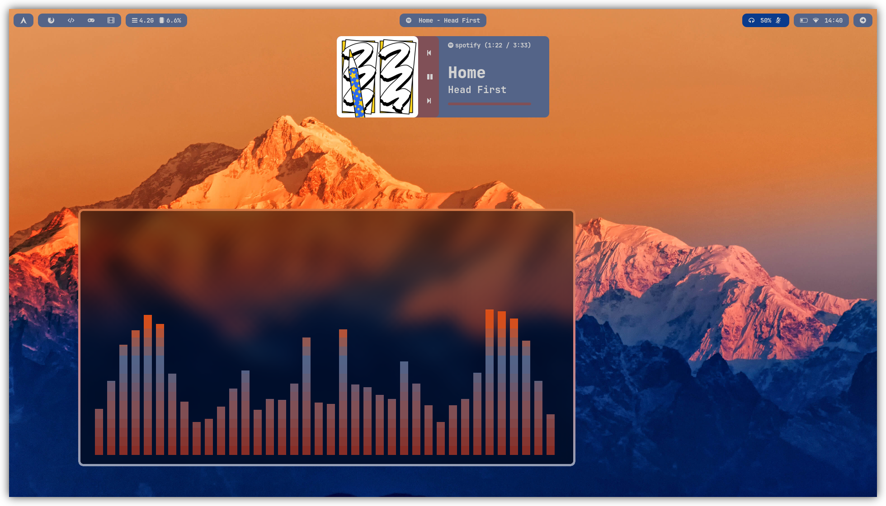
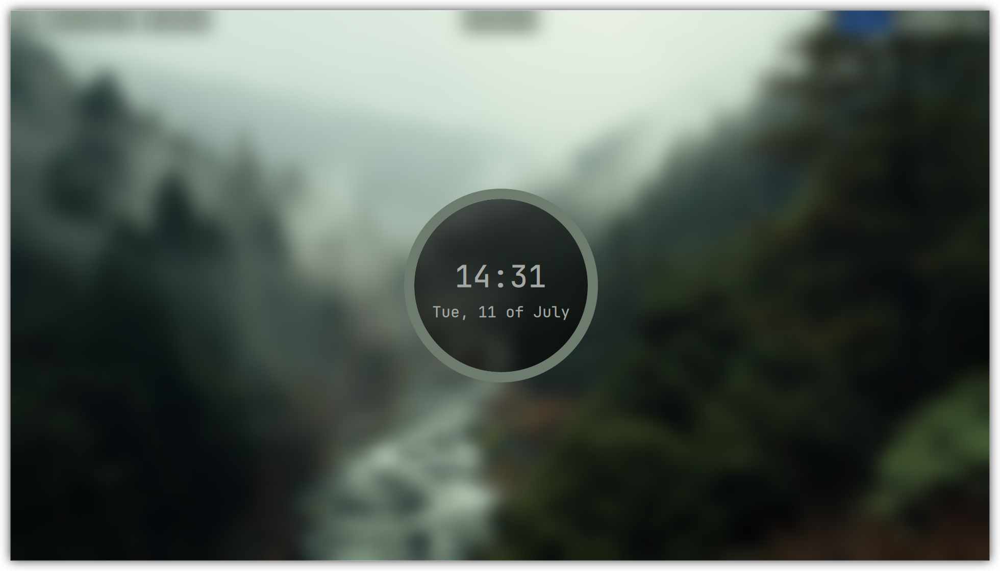
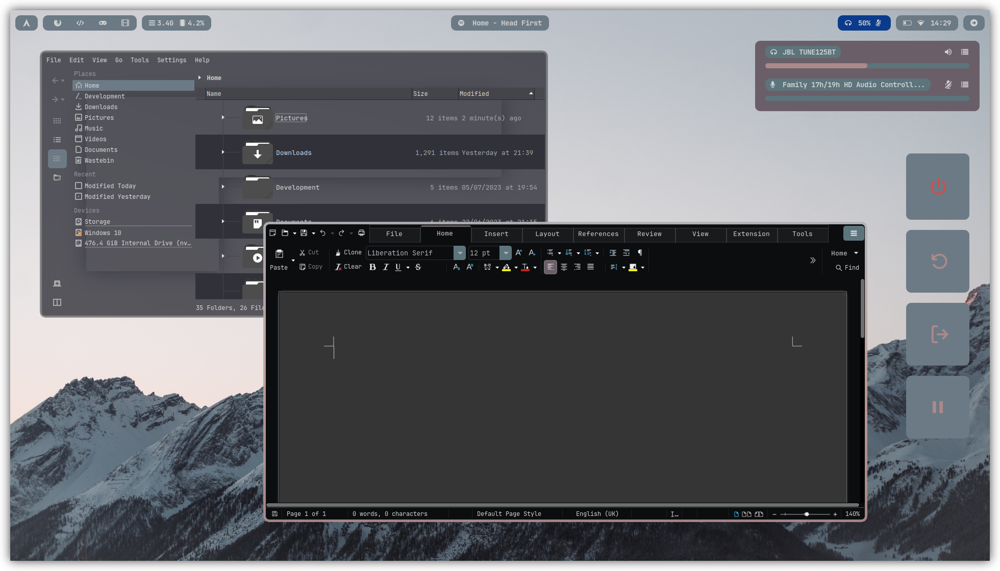

<h2 align="center">Hyprland w/ pywal</h2>

<div align="center">
    <p>Now with unlimited color themes!</p>
    </img>
    </img>
    </img>
</div>

1) Run the install script

```sh
wget https://raw.githubusercontent.com/thor1033/arch-linux-dotfiles/main/install.sh && sh install.sh
```

2) 
### Usage
- If you want to change anything, please configure the `~/.dotfiles/config/` and not directly in your `~/.config/` - then reload with `~/.dotfiles/scripts/reload.py`
- Switch theme with SUPER + H, see `./config/hypr/keybinds.conf` for all keybinds.

### Notes
- The wallpaper path (`~/.dotfiles/wallpapers/`) and pywal backend (`colorthief`) can be modified within the `./scripts/reload.py` file.
- `~/.dotfiles/scripts/reload.py` is the main script that overwrites everything from `~/.dotfiles/config` into your `~/.config/` folder by replacing special strings with color values applicable to the wallpaper.

### Credits and Acknowledgements
- This is a fork from the `https://github.com/Abaan404/dotfiles/`
